# Traffic Sign Recognition

---

**Build a Traffic Sign Recognition Project**

The goals / steps of this project are the following:

-  Load the data set (Train, Validation and Test dataset)
-  Explore, summarize and visualize the data set
	-  Plot Random images
	-  Plot histogram of classes
-  Design, train and test a model architecture using LeNet architecture.
-  On GPU, using Cross validation find the best paramertes on the model.
-  Use the best parameters to train a model to make predictions.
-  Analyze the softmax probabilities of the new images downloaded from the web
-  Run the model on Test data set
- Summarize the results with a written report


[//]: # (Image References)

[image4]: ./examples/placeholder.png "Traffic Sign 1"
[image5]: ./examples/placeholder.png "Traffic Sign 2"
[image6]: ./examples/placeholder.png "Traffic Sign 3"
[image7]: ./examples/placeholder.png "Traffic Sign 4"
[image8]: ./examples/placeholder.png "Traffic Sign 5"

---
### Writeup / README


You're reading it! and here is a link to my [project code](https://github.com/kapild/CarNd-Term1/blob/master/CarND-Traffic-Sign-Classifier-Project/Traffic_Sign_Classifier.ipynb)

### 1. Data Set Summary & Exploration

I used the pandas library to calculate summary statistics of the traffic
signs data set:

* The size of training set is 34799 and shape of each image is 32, 32, 3
* The size of the validation set is 4410
* The size of test set is 12630
* The shape of a traffic sign image is 32, 32, 3
* The number of unique classes/labels in the data set is 43

#### Exploratory visualization of the dataset.

Here is an exploratory visualization of the data set. 

- Randomly plot 6 clasess(number_of_images_per_class) and 5 images per class(number_of_images_per_class)
	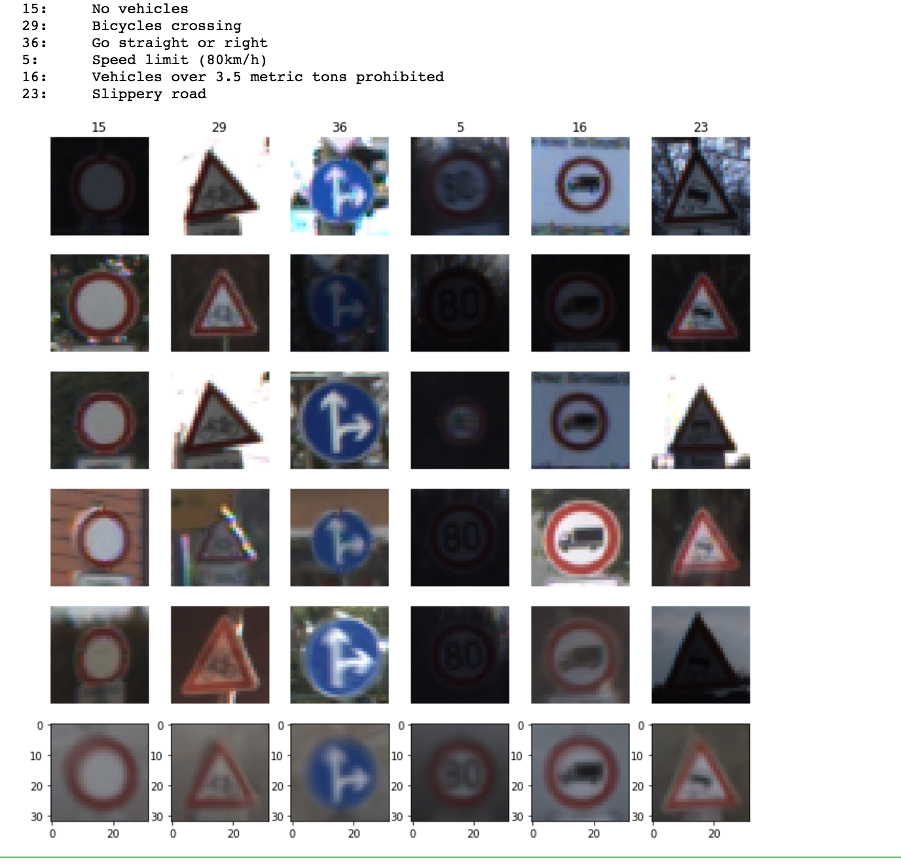
- Size distribution of 42 classes 
	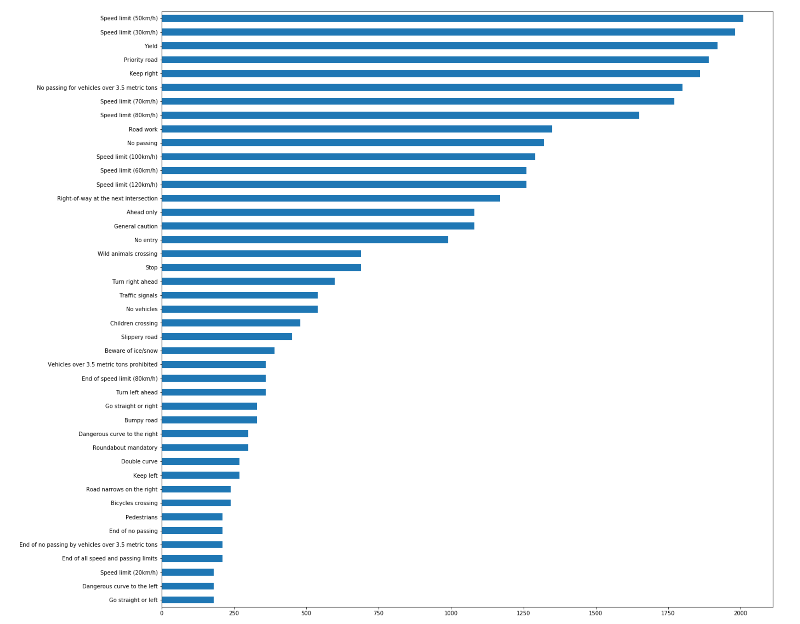


### 2. Design and Test a Model Architecture


Here are the list of steps I used to train the model

- Pre processing step:
	- As a first step, I decided to resize the images to 32 x 32 size. The input imagaes for train and validation data set were 32 X 32. This resize was needed when images were downloaded from the web.
	- Then the second step was to convert the image to grayscale. This was done as it was mentioned in the paper that working on gray scale helped increased the accuracy. Also, gray scale training is faster than RGB channel.
	- Finally, teh gray scale was normalized by subtracting 128 and dividing it by 128.
	- Here are some of the sample images in orginal form, then grayscaled and later normalized.

| Label         		|     Image conversion	        			| 
|:---------------------:|:---------------------------------------------:| 
| Speed limit 70       | 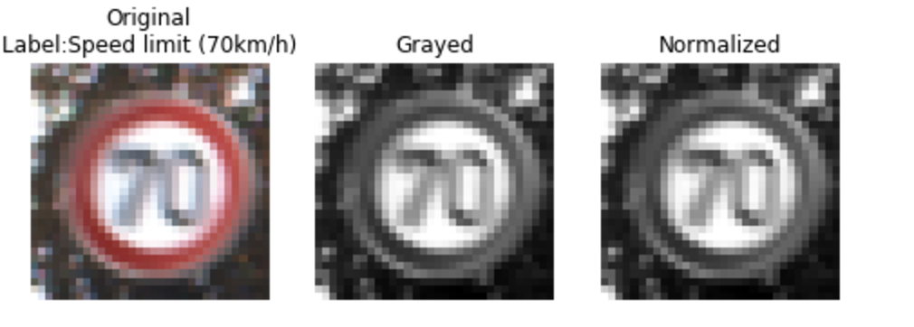   |
| Wild Animal      | 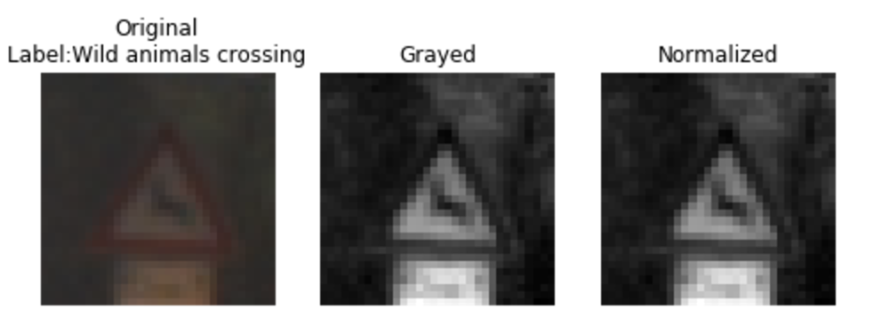|
| Yield       	| 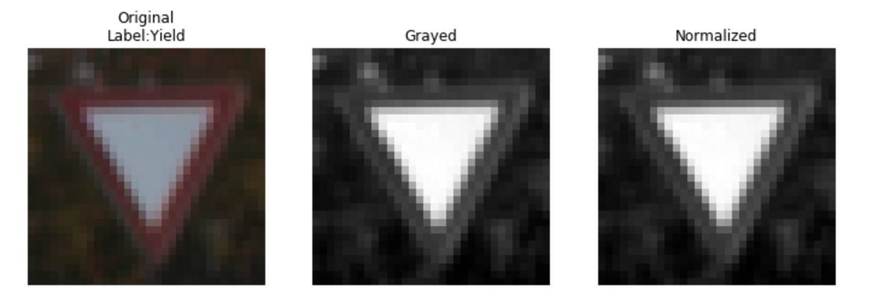 |
| Bumpy Road       | 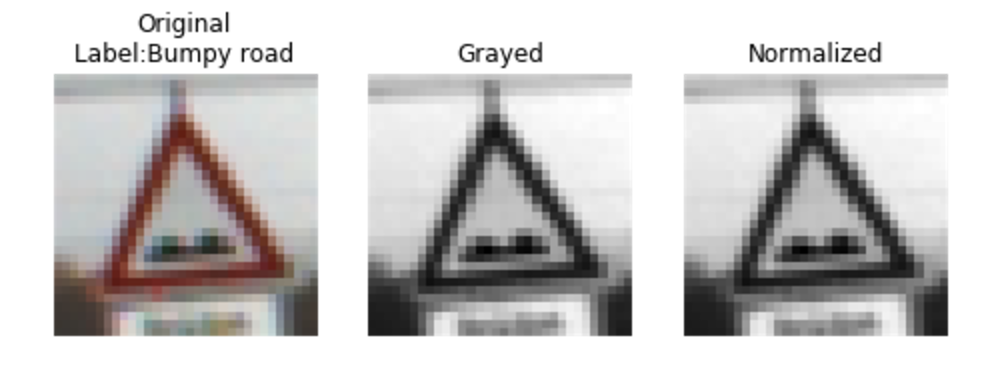  |


**I decided not to generate additional data because I was able to get 95% validation accuracy using the above metioned pipeline.**
As an optional step, later on I will update my project by augumenting the training data with more samples.  


### 3. Convolution Model Architecture:

- The model I used is based out of LeNet architecture
- This is influenced by the LeNet Lab solution.

My final model consisted of the following layers:

Layer Num| Name         		|     Conversion	        					| 
|:---------------------:|:---------------------:|:---------------------------------------------:| 
|| Input         		| 32x32x3 Gray normalized image   							| 
|1| Convolution 5x5     	| 6 filters, 1x1 stride, valid padding, outputs 32x32x64 	|
|| RELU					|												|
|| Max pooling	  2x2    	| 2x2 stride,  outputs 16x16x64 				|
|2| Convolution 5x5	    | 16 filters, 1x1 strides, valid padding outputs 10x10x16.      									|
|| RELU		|         							|
|| Max pooling	  2x2    	| 2x2 stride,  outputs 5x5x16 					|
|3| FC layer	    | 400 layers.      									|
|4| FC layer	    | 120 layers.      									|
|| RELU		|         					
|| Dropout		|         	
|5| FC layer	    | 84 layers. 
|6| Final softmax layer	    | num classes 43.      									
 


####3.1. Training the model: Hyperparameters.

To train the model, I used the following hyperparameter

- **AdamOptimizer** with learning rate lr.
- **BATCH size**: 128
- **EPOCHS**: 15
- **Drop out** probablity
- **Regularized** parameter beta.

####3.2. Finding the best model.

My final model results were:

- training set accuracy of  99.8 %
- validation set accuracy of 95.19 %
- test set accuracy of 91.86%.


I started my model training using LeNet architecture.

- I was able to receive 90% validation accuracy with just plugging the model.
- But, to increase the accuracy I had to add convert the images to grayscale and also perform normalization to the input images.
- This helped me achieve 92% validation accuracy. 
- However, I added dropout after the 2 FC layer. 
- I also refered to this paper "Traffic Sign Recognition with Multi-Scale Convolutional Networks" 
- Model traninig, validation and test accuracy are very close to each other. Also, with every EPOCH the train and validation accuracy increases. This hints that the model is working well.

####3.3. Cross validation: Grid based approach.
To find the best hyper parameters of the model, I extensively used Cross validation approach to find the best parameter to the model. 

- I had 3 hyper parameters to choose from (Learing rate, dropouts, regularization)

```
l_rates= [0.0009, 0.0001, 0.001, 0.0008, 0.002, 0.01, 0.1]
dropouts = [0.5, 0.1, 0.001, 0.2, 0.4, 0.0, 0.6, 0.8]
betas = [0, 0.001, 0.002, 0.003, 0.01, 0.02, 0.07, 0.1, 0.4, 0.7, 1]
```

- Each iteration on GPU was 4 times faster than on CPU. Here are the output from sample run

```
****************************************************
****************************************************
258 of 616
Running for 0.00100, 0.80000, 0.01000, 
Training...

Final Accuracy 0.92404, 
This CV time.
	Total time taken hours = 0.010
	Total time taken mins = 0.580
So far all CV time.
	Total time taken hours = 0.019
	Total time taken mins = 1.165
****************************************************
****************************************************
259 of 616
Running for 0.00100, 0.80000, 0.02000, 
Training...

Final Accuracy 0.91723, 
This CV time.
	Total time taken hours = 0.010
	Total time taken mins = 0.581
So far all CV time.
	Total time taken hours = 0.029
	Total time taken mins = 1.747
****************************************************
****************************************************
260 of 616
Running for 0.00100, 0.80000, 0.07000, 
Training...

Final Accuracy 0.74263, 
This CV time.
	Total time taken hours = 0.010
	Total time taken mins = 0.583
So far all CV time.
	Total time taken hours = 0.039
	Total time taken mins = 2.330
****************************************************
```
- Best accuracy : best validation accuracy achieved during cross-validation: 95.8%

	```
	(0.002, 0.8, 0) = (learning rate, drop out, regularization beta)
	```

- The affect of accuracy on the pairs of (learning rate, dropout, and beta)

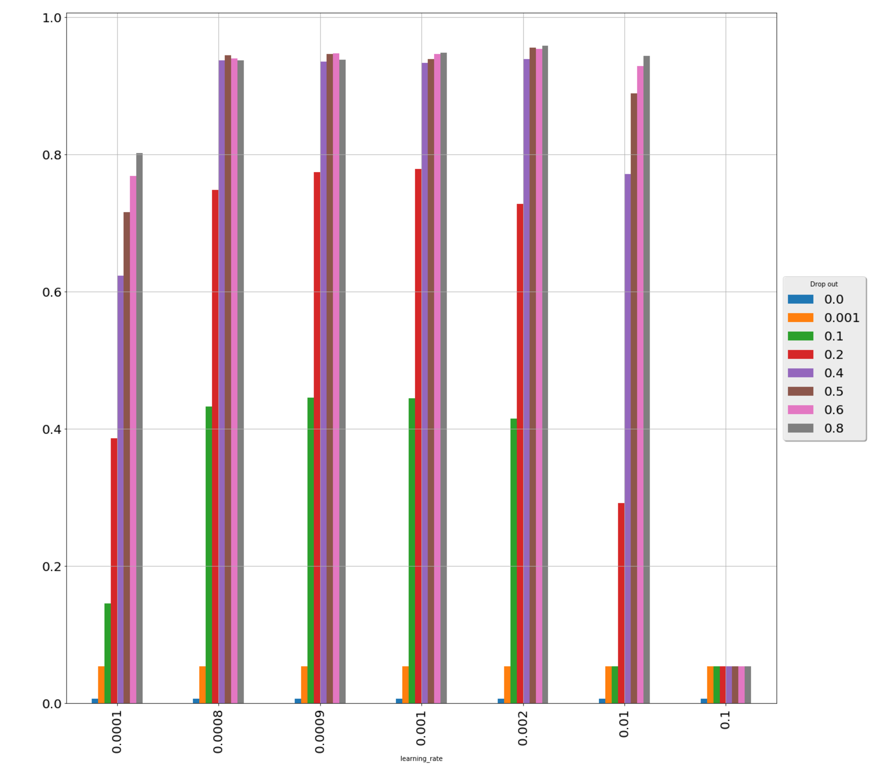
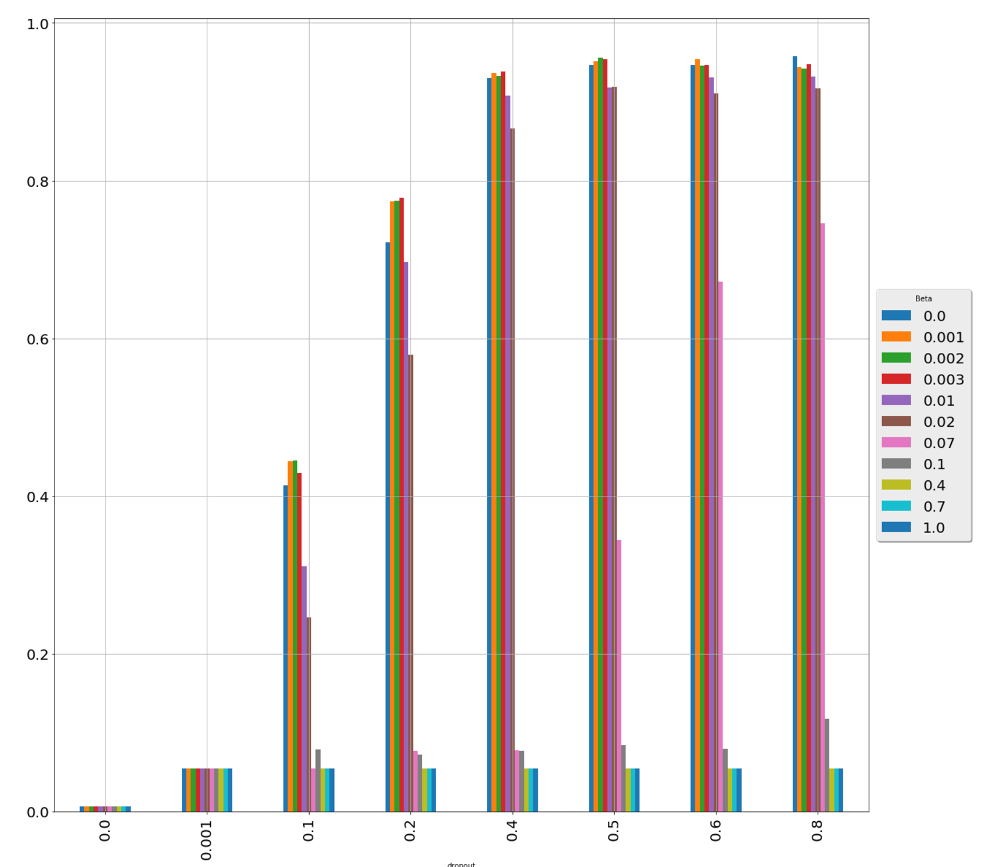
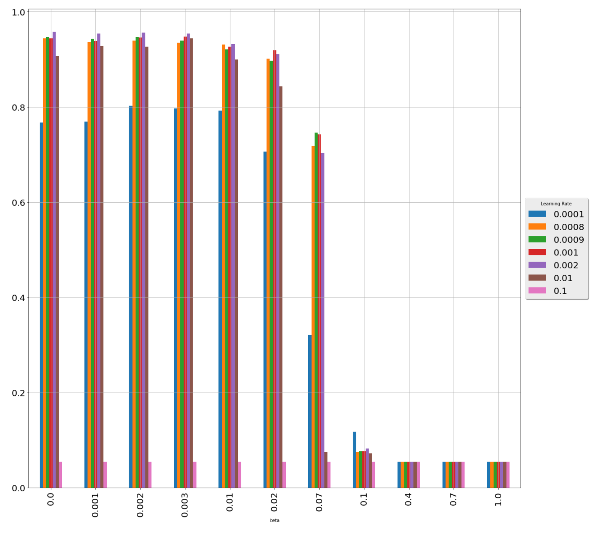

### best validation accuracy achieved during cross-validation: 0.958050
### parameters (0.002, 0.8, 0)

####3.4. Confusion matrix.
- Confusion matrix on the validation data set was plotted.
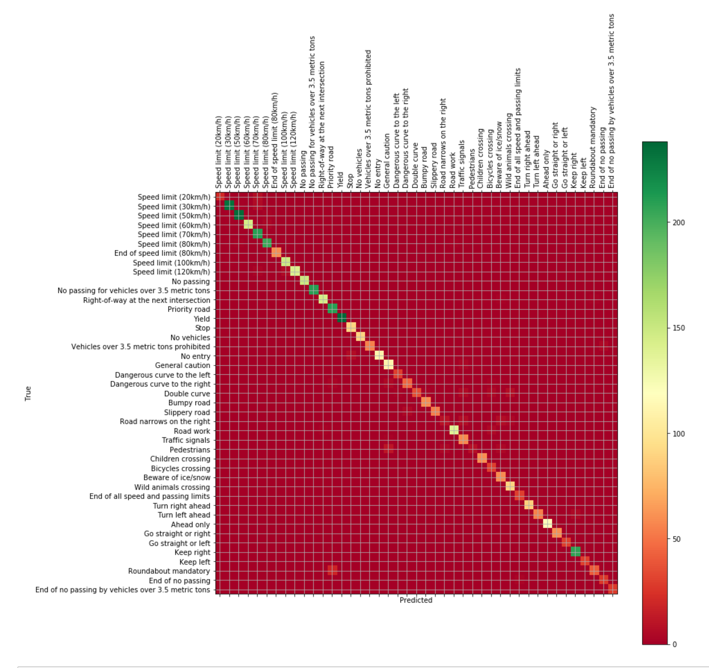

### Optional:
I started looking into the following but its not part of my submission yet. 

- Adding another convolution layer to the model.
- Using Xavier initialization of the convolution layers.

--

### Test a Model on New Images

#### 1. Sample images were downloaded from the internet and classified using the best CV model.

Here are 10 German traffic signs(cropped) that I found on the web:

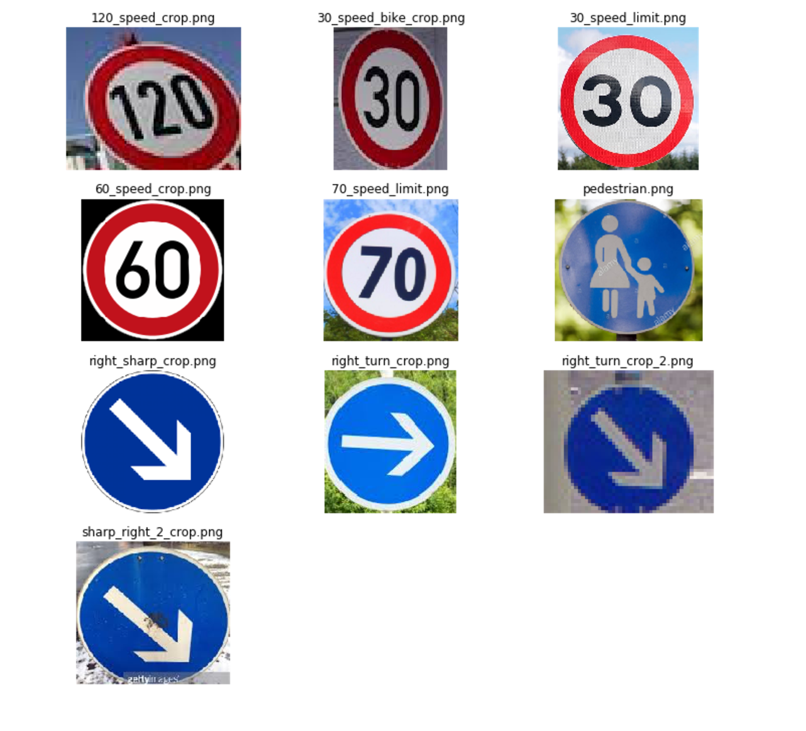

- The first image (120 speed limit) might be difficult to classify because its inclided from the perspective of the camera.
- The second image might (30 speed limit) be difficult to classify because its inclided from the perspective of the camera.
- The third image might (30 speed limit) should be easy to classify.


#### 2. Sample images vs Test images

- The model was able to correctly guess 5 of the 10 traffic signs, which gives an accuracy of 50%. 
- This accuracy is signifinactly lower than the test accuracy of 91.8%

Here are the results of the prediction. (The title is the predicted title of the image)

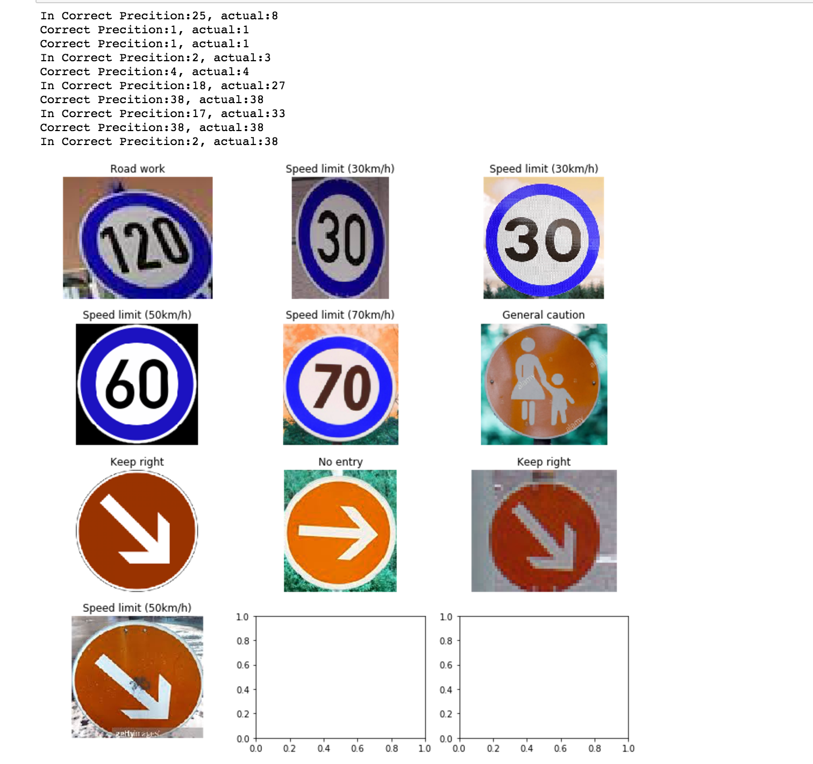

Sample test accuracy is low than that of test bed accuracy.


#### 3. Top 5 softmax probablities.
Describe how certain the model is when predicting on each of the five new images by looking at the softmax probabilities for each prediction. Provide the top 5 softmax probabilities for each image along with the sign type of each probability. 


- For the first image, True label is `120 Speed`. 
- 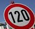
- The model is unable to predict the correct class in top 5 positions.
- The top five soft max probabilities were


| Probability         	|     Prediction	        					| 
|:---------------------:|:---------------------------------------------:| 
|0.858 |Keep right| 
|0.065 |Ahead only
|0.039 |Turn left ahead
|0.012 |General caution
|0.010 |Go straight or right


- For the second image True label is `30 Speed` 
- 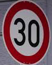
- The model is 100% certian on picking the correct label.

| Probability         	|     Prediction	        					| 
|:---------------------:|:---------------------------------------------:| 
|1.000 |Speed limit (30km/h)
|0.000 |Speed limit (20km/h)
|0.000 |Speed limit (50km/h)
|0.000 |Keep right
|0.000 |Speed limit (60km/h)

- For the third image True label is `30 Speed` 
- 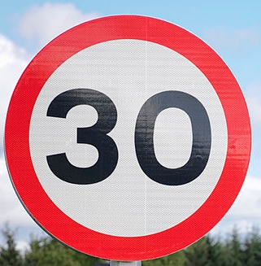
- The model is unable to predict the correct class in top 5 positions.

| Probability         	|     Prediction	        					| 
|:---------------------:|:---------------------------------------------:| 
|1.000 |Speed limit (60km/h)
|0.000 |Speed limit (80km/h)
|0.000 |Road work
|0.000 |Wild animals crossing
|0.000 |End of speed limit (80km/h)


- For the fourth image True label is `60 Speed`  
- 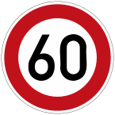
- The model is able to predict the correct class in 4th position.

| Probability         	|     Prediction	        					| 
|:---------------------:|:---------------------------------------------:| 
|1.000 |Speed limit (50km/h)
|0.000 |Keep right
|0.000 |Speed limit (30km/h)
|0.000 |Speed limit (60km/h)
|0.000 |Speed limit (80km/h)

- For the fifth image True label is `70 Speed` 
- 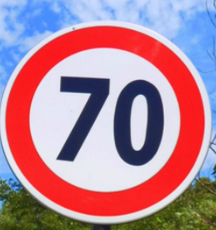
- The model is 100% certian on picking the correct label.

| Probability         	|     Prediction	        					| 
|:---------------------:|:---------------------------------------------:| 
|1.000 |Speed limit (70km/h)
|0.000 |Speed limit (20km/h)
|0.000 |Speed limit (30km/h)
|0.000 |Go straight or left
|0.000 |Speed limit (80km/h)


--

## Test data set
- Accuracy 91.86%
- Some ramdon plotted images from test bed.
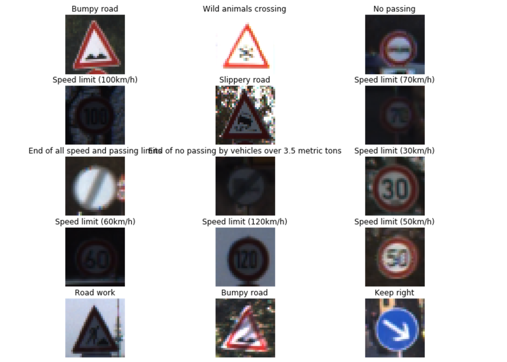

- Confusion matrix for test data
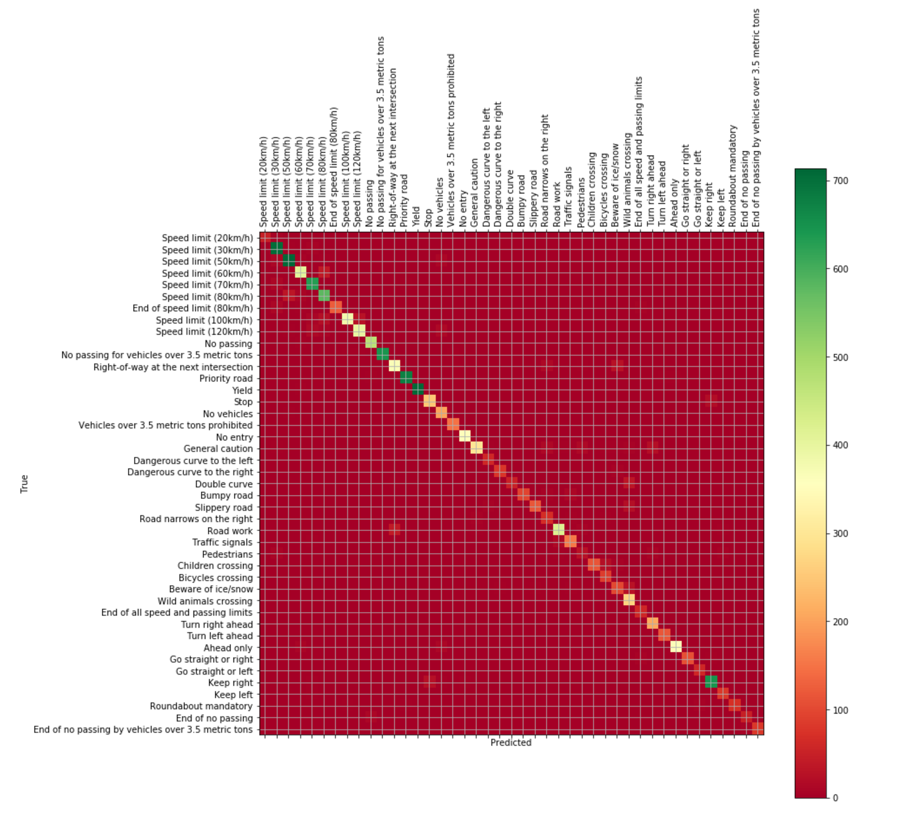

### (Optional) Visualizing the Neural Network (See Step 4 of the Ipython notebook for more details)

- NA

### Next Steps
- [ ] Run the model using Xavier initilization
- [ ] Change the model architecture by adding more FC and Conv. layers
- [ ] Data Augumentation using rotation, translations, color perturbation 
- [ ] Model and graph loading Model.Saver()
- [ ] Vizualize model layers etc


Some of my learning are based from this [blog post](https://medium.com/@jeremyeshannon/udacity-self-driving-car-nanodegree-project-2-traffic-sign-classifier-f52d33d4be9f)
