# Vehicle Detection Project

### Goal 
The goal of this project is to perform vehicle detection using a trained labelled data set.


### Steps of this project are the following:

* Perform a Histogram of Oriented Gradients (HOG) feature extraction on a labeled training set of images and train a classifier Linear SVM classifier
* Additionally, use color transform and append binned color features, as well as histograms of color, to your HOG feature vector. 
* Normalize the features set and use random selection for training and testing.
* Implement a sliding-window technique at various scales and use your trained classifier to search for vehicles in images.
* Run your pipeline on a video stream (start with the test_video.mp4 and later implement on full project_video.mp4) and create a heat map of recurring detections frame by frame to reject outliers and follow detected vehicles.
* Estimate a bounding box for vehicles detected using OpenCV functions.

[//]: # (Image References)
[image1]: ./output_images/image_not_image_1.png
[image2]: ./output_images/image_not_image_2.png
[image3]: ./output_images/image_not_image_3.png


[image_hog_1]: ./output_images/hog_1.png
[image_hog_2]: ./output_images/hog_2.png
[image_hog_3]: ./output_images/hog_3.png
[image_hog_4]: ./output_images/hog_4.png
[image_hog_5]: ./output_images/hog_5.png

<!--[image2]: ./examples/HOG_example.jpg
<[image3]: ./examples/sliding_windows.jpg
-->
<!--[image4]: ./examples/sliding_window.jpg
[image5]: ./examples/bboxes_and_heat.png
[image6]: ./examples/labels_map.png
[image7]: ./examples/output_bboxes.png
-->
[video1]: ./project_video.mp4

-- 
### README

#### 1. Provide a Writeup / README that includes all the rubric points. 
You're reading it!

### 2. Histogram of Oriented Gradients (HOG)

#### 2.1. Explain how (and identify where in your code) you extracted HOG features from the training images.

The code for this piece is in the section `3. Hog Features` of the the notebook.
I implemented two version of calculating `HOG Features`. First one was very naive, and ran on every window of the image. 

#### HOG features Steps: 
Some of the steps to find out HOG features.

- I started by reading in all the `images_cars` and `images_no_cars` images.  Here is an example of one of each of the `vehicle` and `non-vehicle` classes:

![alt text][image1]
![alt text][image2]
![alt text][image3]


The function used to extract Hog geatures is :
This internally calls `hog` function from `from skimage.feature import hog`

```
from skimage.feature import hog
def get_hog_features(img, orient, pix_per_cell, cell_per_block, 
                        vis=False, feature_vec=True)
    return hog()
```
	
- I then explored  `skimage.hog()` parameters (`orientations`, `pixels_per_cell`, and `cells_per_block`).  I grabbed random images from each of the two classes and displayed them to get a feel for what the `skimage.hog()` output looks like.
	- Here is an example using the `YCrCb` color space and HOG parameters of `orintations=9`, `pixels_per_cell=(8, 8)` and `cells_per_block=(2, 2)`:


	- ![alt text][image_hog_1]
	- ![alt text][image_hog_2]
	- ![alt text][image_hog_3]
	- ![alt text][image_hog_4]
	- ![alt text][image_hog_5]
	

#### 2. Explain how you settled on your final choice of HOG parameters.

I tried various combinations of parameters and. I picked the one which gave me the best accuracy score on my test sets. 

The code for this is implemented in the following section oh my iPython Notebook.

```
## 5. Extract HOG features 
### 5.1 Normalize features
```
 - **Using**: 9 orientations 8 pixels per cell and 2 cells per block, I had total Feature vector length: 5292
 - **Acuracy:** HOG feature alone gave me an accuracy of ` 0.9685`


#### 3. Describe how (and identify where in your code) you trained a classifier using your selected HOG features (and color features if you used them).

I used a combination of 3 set of features to train my classifier. Additionally, I played with different color scales to train my classifier. 
### 3.1 Features & Color Spaces
- I used 3 set of **features**:
	- Bin Features 
	- Color Histogram
	- Hog Features
- **Color spaces**:
	- Out of the following `RGB, HSV, LUV, HLS, YUV, YCrCb`, I picked 3 color spaces

		```
		color_spaces = ['YCrCb', 'RGB', 'HLS'] #'RGB' 		
		```


Let's discuss about them in detail

### 3.2.1 Bin Features:
- This feature implementation is implemented in section `## 1. Define Bin features` of the notebook
- The function implementation **bin_spatial**:

 ```
	def bin_spatial(img, color_space='RGB', size=(32, 32)):
    # Convert image to new color space (if specified)
   ```

|      Color Space		|     	        	Bin Size 32 |     	        	Bin Size 64		| 
|:---------------------:|:---------------------------------------------:| :---------------------------------------------:|
|	RGB      | 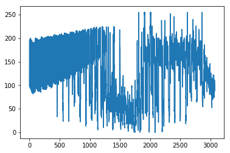   |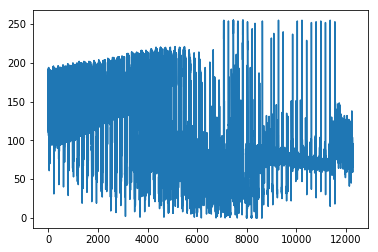 |
| 	 HSV     | 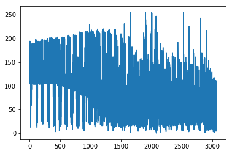| 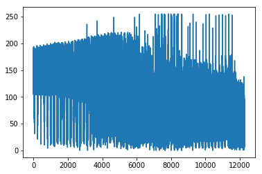|

### 3.2.2 Color Histogram Features:
- This feature implementation is implemented in section `## 2. Color histogram` of the notebook.
- For this features, histogram of color for all 3 chanells are computed. This is then binned in the bin size of `nbins`. 
- The function implementation **color_hist**:

 ```
	def color_hist(image, nbins=32, bins_range=(0, 256)):
    # remove bins ranges for png files. 
   ```

|      Color Space		|     	        	Bin Size 32 |     	        	Bin Size 64		| 
|:---------------------:|:---------------------------------------------:| :---------------------------------------------:|
|	RGB      | 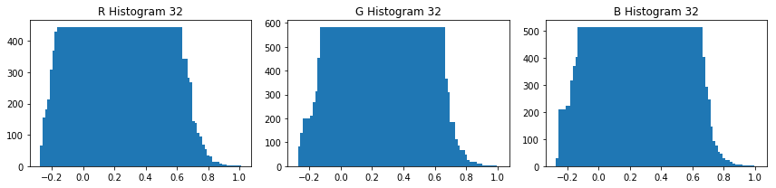   |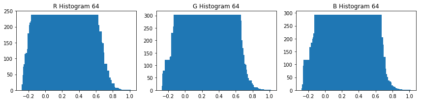 |
| 	 HSV     | 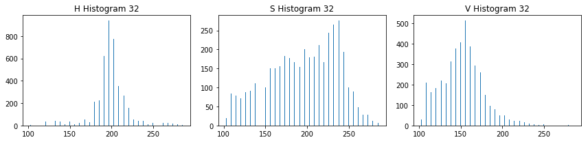| 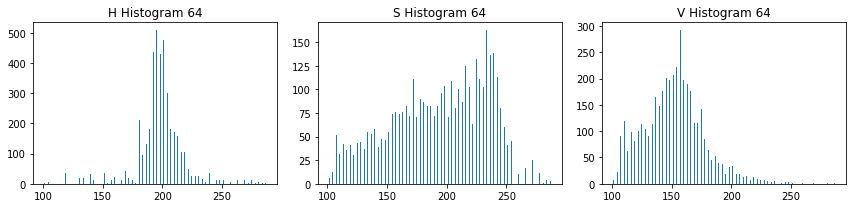|
		

### 3.2.3 HOG Features:

- The function used to extract Hog geatures is :
- This internally calls `hog` function from `from skimage.feature import hog`

	```
	from skimage.feature import hog
	def get_hog_features(img, orient, pix_per_cell, cell_per_block, 
	                        vis=False, feature_vec=True)
	    return hog()
	```
- I then explored  `skimage.hog()` parameters (`orientations`, `pixels_per_cell`, and `cells_per_block`).  
- I grabbed random images from each of the two classes and displayed them to get a feel for what the `skimage.hog()` output looks like.
- Here is an example using the `YCrCb` color space and HOG parameters of `orintations=9`, `pixels_per_cell=(8, 8)` and `cells_per_block=(2, 2)`:


|      Image Type		| Sample 1 |	Sample 2| 
|:---------------------:|:---------------------------------------------:| :---------------------------------------------:|
|	Car Image      | ![alt text][image_hog_1]  |![alt text][image_hog_2] |
| 	 Not Car Image     |![alt text][image_hog_4]| ![alt text][image_hog_5]|


### 3.3 Train the classifer:

### 3.3.1 Feature Normalization.

- First step, is to perform feature normalization.
	- This is implemeneted in section `4.1 Normalize features`
   - Normalization is done via `StandardScaler`
   
		```
		def normalize_features(car_features, notcar_features):
	   		X = np.vstack((car_features, notcar_features)).astype(np.float64)                        
		    X_scaler = StandardScaler().fit(X)
	     	scaled_X = X_scaler.transform(X)
		```
		
### 3.3.2 Classify images.

- Second step is to combine all features.
- However, before training an end to end classifier, I computed the accuracy of my test data on each of the features mentioned above individually.

	- Test accuracy for each feature type

	|      Feature Type		| Model Type 1 |Accuracy | 
	|:---------------:|:-----------------------:| :----------:|
	|	Bin and Histogram Classify | LinearSVC  | 93.81|
	| 	HOG Classify RGB  | LinearSVC | 96.85|
	| 	HOG Classify YCrCb  | LinearSVC | 98.09|

- Next step was to combine all three feature type for one color space `YCrCb `
	- This is implemented in section `7. Combine all features` of the notebook
	- This section iterate over all the images and computes the feature for single image. 
	- All these features are then concatenated. 
	
		```
		def extract_features(imgs, color_spaces=['RGB'], spatial_size=(32, 32),
	                        hist_bins=32, orient=9, 
	                        pix_per_cell=8, cell_per_block=2, hog_channel=0,
		                    spatial_feat=True, hist_feat=True, hog_feat=True):	
            single_img_features()
		```
		
		```
		def single_img_features(image, color_space='RGB', spatial_size=(32, 32),
                        hist_bins=32, orient=9, 
                        pix_per_cell=8, cell_per_block=2, hog_channel=0,
                        spatial_feat=True, hist_feat=True, hog_feat=True):   

	          return np.concatenate(img_features)              		
		```
	- After combining the accuracy for all color space was calculated. 

		|      Feature Type		| Model Type 1 |Color Space | Accuracy | 
		|:---------------:|:-----------------------:| :----------:|:----------:|
		| 	spatial feat:True hist feat:True hog feat:True | LinearSVC | RGB| 98.76|
		|	spatial feat:True hist feat:True hog feat:True| LinearSVC  |YCrCb| 99.27|
		| 	spatial feat:True hist feat:True hog feat:True | LinearSVC | HLS | 99.38|
		


**Note**: Although, this is a very high accuracy it comes at the cost of speed. At run time, the model has to 
extract features for all 3 color spaces. 

--

### 4. Sliding Window Search

#### 1. Describe how (and identify where in your code) you implemented a sliding window search.  How did you decide what scales to search and how much to overlap windows?

I choose two different approaches to run sliding window technique. 

 - First one is implemented in section `6. Sliding window` of the notebook.
 - Second one is implemented in section `8 Search Windows` of the notebook.

 

Lets discuss each of them in detail

### 4.1 Sliding Window
- The function definition for this section is 

	```
	def slide_window(image, x_start_stop=[None, None], y_start_stop=[None, None], 
	                    xy_window=(128, 128), xy_overlap=(0.5, 0.5))
	```
- The function take an input image and start positon of x and y and uses that to slide window in the image. 
- The window size is determined using `xy_window `, whereas the overlap is done using `xy_overlap `
- For various combination, we get different sliding window region.

	|      Window size		|  Overlap |   XY Start |   output 		| 
	|:------------------------:|:---------------------:| :----------------------:|:-----------------:|
	|	128 x 128      | 50 pct x 50 Pct |None, None|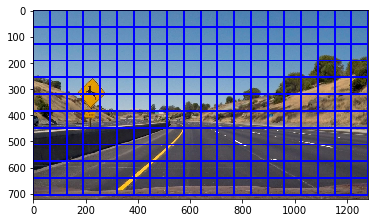 |
	| 	128 x 128      | 10 pct x 10 Pct| None, None|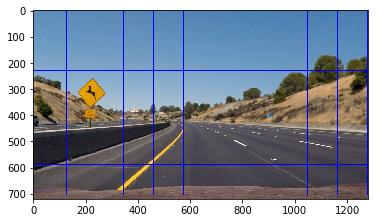 |
	|	50 x 50      | 50 pct x 50 Pct |None, None|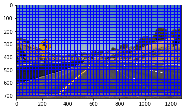 |
	| 	50 x 50      | 10 pct x 10 Pct| None, None| |
	|	50 x 50      | 50 pct x 50 Pct |x start stop=[200, None], y start stop=[400, 700]|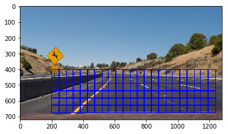 |
	| 	50 x 50      | 10 pct x 10 Pct|x start stop=[200, None], y start stop=[400, 700]| |
- The prediction for this window search is implemented in section `8 Search Windows`

	|      slide_window		| search_windows |
	|:---------------------:|:---------------------------------------------:|
	|	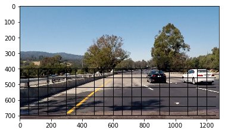 |  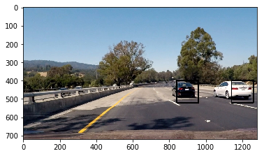  |
		

### 4.2 Hog sub-sampling window search

A more complex and advance version of detecting car is implemented in section `9. Hog sub-sampling window search` of the noetbook.

- Initially, the idea to implement this pipeline was pretty starightforward. Instead of computing hog features in all the sections of the windows, this section computed to features at a particular scale and then ran the classification. 
- As a first step, I impelmented this pipeline for one scale. But, after running the pipeline on test images I couldn't find any scale which could detect vechiles at various position of the image.

#### 4.2.1 Test images at different scales 1, 1.5, 1.75 and 2.0
- Green boxes is the search area (also mentioned in the title). The size differ due to different scales.
- Blue boxes are the prediction.


#### 4.2.2 Prediction of Test images at different scales 1, 1.5, 1.75 and 2.0.
- You can see that vehicles which are far off from the camera are only detected using lower value of scales `1.0` and `1.5`
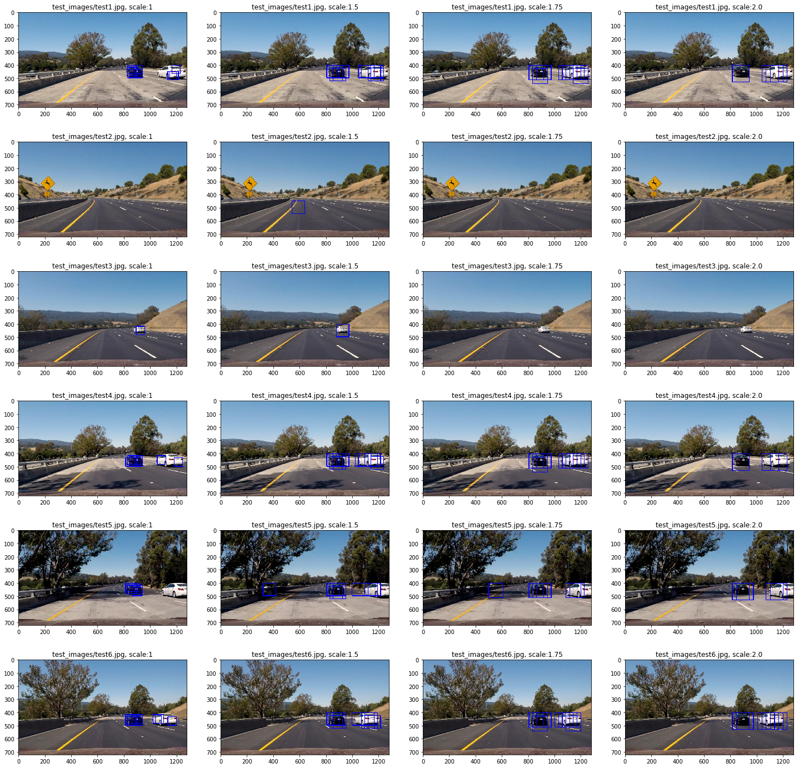

#### 4.2.3 Small scales for far detection and high scale for near detection.
- Hence, to alleviate the problem of detection of different scales, I decided to run the pipeline at two different scales. 
- `scale_far`: This scale was used to detect vehicle which are far in the image horizon. 
- `scale_close`: This scale was used to detect vehicle which are close in the image horizon. 
- Obviously, `scale_far` < `scale_close `
- The function definition :

	```
	def find_cars_scaled(image, ystart, ystop, 1, 2, svc, X_scaler, orient, pix_per_cell,
		cell_per_block, spatial_size, hist_bins, normalize_img_format=True, 
       plot_debug=True, color_spaces=color_spaces)
	```

#### 2. Show some examples of test images to demonstrate how your pipeline is working.  What did you do to optimize the performance of your classifier?

Ultimately,  I searched on two scales 1.0 and 1.75 and used 3 color spaces all 3-channel HOG features plus spatially binned color and histograms of color in the feature vector, which provided a nice result.
		
- After playing with different color spaces and feature combination, I decided to combine them all. 
- Why choose, when you can combine them all.
- Thus, I changed my pipeline so that it can take an array of color spaces `color_space`, and all of them are used to compute the accuracy of the data set.

```
scale_far = 1.0
scale_close = 1.75
color_spaces = ['YCrCb', 'RGB', 'HLS']    
```

### Final test accuracy 

|      Feature Type		| Model Type 1 |Color Space | Accuracy | 
|:---------------:|:-----------------------:| :----------:|:----------:|
| 	spatial feat:True hist feat:True hog feat:True | LinearSVC | ['YCrCb', 'RGB', 'HLS']| 99.41|


### Here are some example of detecting vehicles:

|      Test Image		|  Prediction  
|:---------------------:|:---------------------------------------------:|
|	Test Image 1      |    |
|	Test Image 2      |    |
|	Test Image 3      | 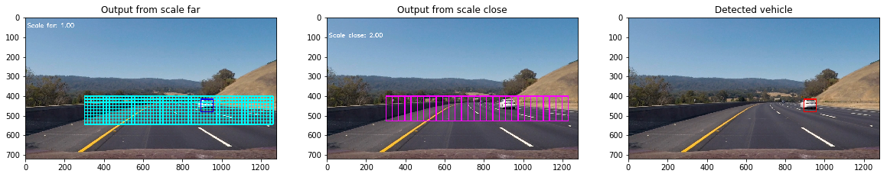   |
|	Test Image 4     | 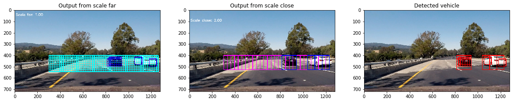   |
|	Test Image 5      |    |
|	Test Image 6      | 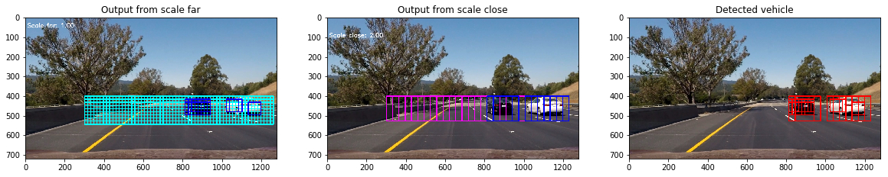   |

- As you can see, predicion works for all 6 images now. 


--

### 5. Video Implementation

#### 5.1. Provide a link to your final video output.  Your pipeline should perform reasonably well on the entire project video (somewhat wobbly or unstable bounding boxes are ok as long as you are identifying the vehicles most of the time with minimal false positives.)

Here's a [link to my video result](./out_videos/final_YCrCb_color_RGB_color_HLS_threhold_1_project_video_out_multi_scale_merge_mid_merge.mp4)


#### 5.2. Describe how (and identify where in your code) you implemented some kind of filter for false positives and some method for combining overlapping bounding boxes.

- False positive and overlapping bounding boxes are implemented in section `10. False positive and Multiple detection` of the notebook.
 
To remove false positive I took two main approaches

- HEAT Map
- Narrow down search area.


### 5.2.1 HEAT MAP
- I recorded the positions of positive detections in each frame of the video.  From the positive detections I created a heatmap and then thresholded that map to identify vehicle positions.  I then used `scipy.ndimage.measurements.label()` to identify individual blobs in the heatmap.  I then assumed each blob corresponded to a vehicle.  I constructed bounding boxes to cover the area of each blob detected.  
- **Threshold**: I played with the value of `1.0` and `2.0`. Although, this initially was giving me vehicle detection on the other side of the incoming lane, after removing the X side of search space, I setlled for 1 
	- The bounding boxes from the `find_cars_scaled`, were then passed to `add_heat` function.
	- Later on, a thresholding was applied using `apply_threshold` function.
	- Finally, using the result of `scipy.ndimage.measurements.label()` and the bounding boxes were then overlaid on the last frame of video.

Here's an example result showing the heatmap from a series of frames of video,
### Here are six frames and their corresponding heatmaps:

|      Test Image		|  Prediction and Heat Maps  
|:---------------------:|:---------------------------------------------:|
|	Test Image 1      | 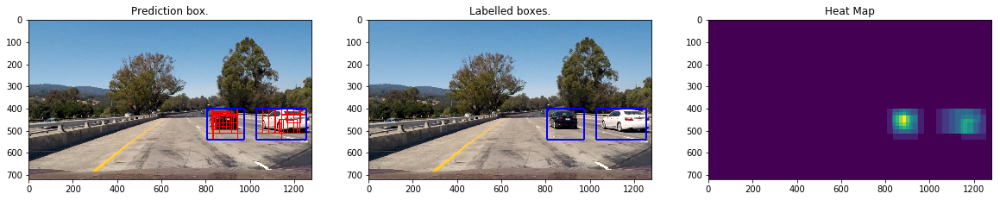   |
|	Test Image 2      | 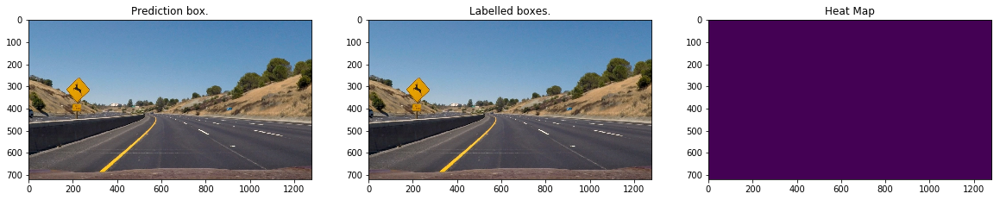   |
|	Test Image 3      | 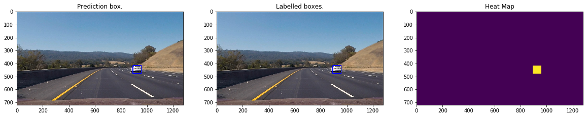   |
|	Test Image 4     | 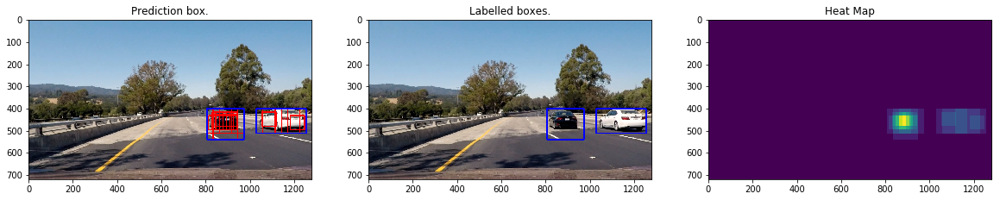   |
|	Test Image 5      | 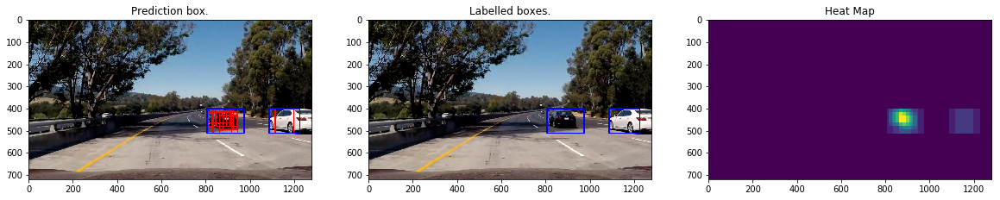   |
|	Test Image 6      | 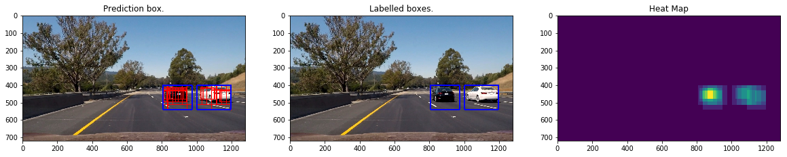   |

<!--### Here is the output of `scipy.ndimage.measurements.label()` on the integrated heatmap from all six frames:
![alt text][image6]

### Here the resulting bounding boxes are drawn onto the last frame in the series:
![alt text][image7]
-->

### 5.2.2 Narrow down Search space 
- For the current project video, no vehicle will be present on the horizon. 
- Additionally, no vehicle should be detected on the opposite lane. 

To achieve this, I narrowed down my search space. This is implemented here:-

```
ystart = 400
ystop = 700
img_tosearch = img_normalized[ystart:ystop,:,:]
x_start = 300
img_tosearch = img_tosearch[:,x_start:,:]

```

### 5.3 Debug 
Additionally, to understand what is happening in the pipeline, I composed all the images for each frame in a debug window.

This is implemented here:- 

```
def compose_debug_images(debug_images):
```
- Here's a [link to my debug video result](./out_videos/debug_YCrCb_color_RGB_color_HLS_threhold_1_project_video_out_multi_scale_merge_mid_debug.mp4)


###Discussion

####1. Briefly discuss any problems / issues you faced in your implementation of this project.  Where will your pipeline likely fail?  What could you do to make it more robust?

Here I'll talk about the approach I took, what techniques I used, what worked and why, where the pipeline might fail and how I might improve it if I were going to pursue this project further.  

 - `Speed`: Since, I am using 3 color spaces at multi scales, the pipeline is very slow. This is not realtime. Better approach can be used. Some ideas
	 - Use `convolution network` to detect images instead of `SVM`
	 - Cross validate on Color space to find best color space instead of all three.
- `False positive`: I do observe some false positive in the pipeline. Shadow frame was detected as vehicle. This can be reduced by doing the following: 
 - Using more training data.
 - Augumenting the current training data by adding shadows, rotation, scale invariance. This will be useful as the current classification technique is not usin Convolution neural networks.
- `Better Faster algorithm`: Region Proposal networks.
	- Faster R-CNN
	- YOLO are the current state of the art image detection. Use that for vehicle detection. 
- Pipeline will fail in case driving is in `center of the lane`. Since, I added a X filtering, the pipeline will not be able to detect vehicles left of image. 
	
